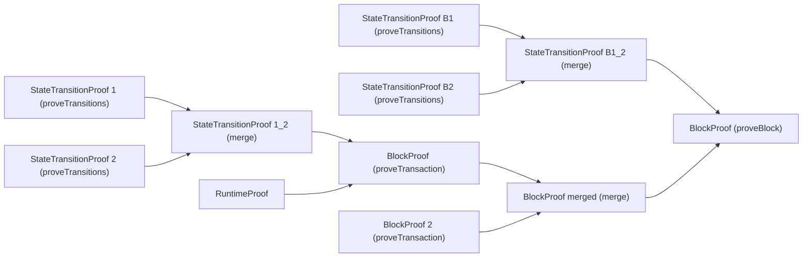

#### Block Proving Pipeline

The blockproving has 3 steps that kind of run independently but are combined to generate a single BlockProof to be used to settlement.

1. StateTransition Reduction Pipeline:
  This Step roughly takes an StateTransition[] and turns it into a proof attesting to the transformation from `stateRootA -> stateRootB` with a commitment to the StateTransitions `stateTransitionsHash`.
  In the case there are more STs than the batch size, this is done recursively by merging the individual parts as a tree (a recurring pattern).

2. Runtime Proof
This is a, once per transaction, executed proof of a runtime execution, it roughly proves a relation `Transaction -> ST[] via stateTransitionsHash`

3. Transaction Proof
This proof is actually part of the BlockProver circuit for technical reasons, but is essentially proves
  `(stProof, runtimeProof) -> fromStateRoot, toStateRoot, tx[] via transactionsHash`. A Transaction[] is grouped into blocks, and for each block, it's transactions BlockProofs are merged into one.
Subsequently, i will refer to them as "transaction proof" or "txProof", even though they are technically part of the BlockProver circuit,
because they semantically prove the correct execution of one tx or a tx[], with no real releation to the concept of a block.

4. BlockProof
This proof proves takes a `txProof`, a `stProof` and executes a few steps
- execute beforeBlock hooks
- apply merged TransactionProof
- execute afterBlock hooks
- apply ST[] that was generated by afterBlock via the provided `stProof`
- Save the block into the blockHashTree
If there are multiple blocks, we merge them into 1 proof that we can then use for settlement
  In the following diagram, all tree-like merging operations (reductions) are depicted for the case that there are 2 proof to keep it overviewable. Assume that there can be arbitrarily many proofs to merge (but then the tree would obviously grow).

